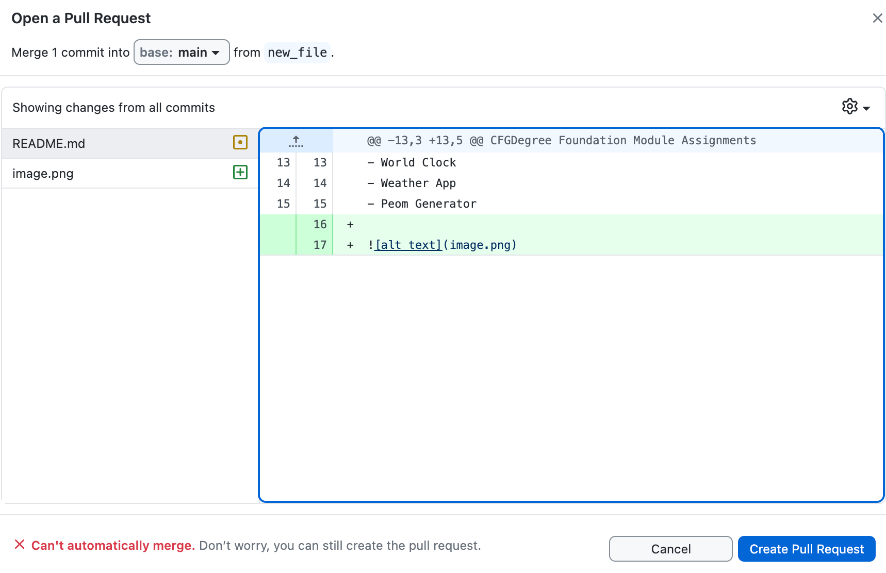
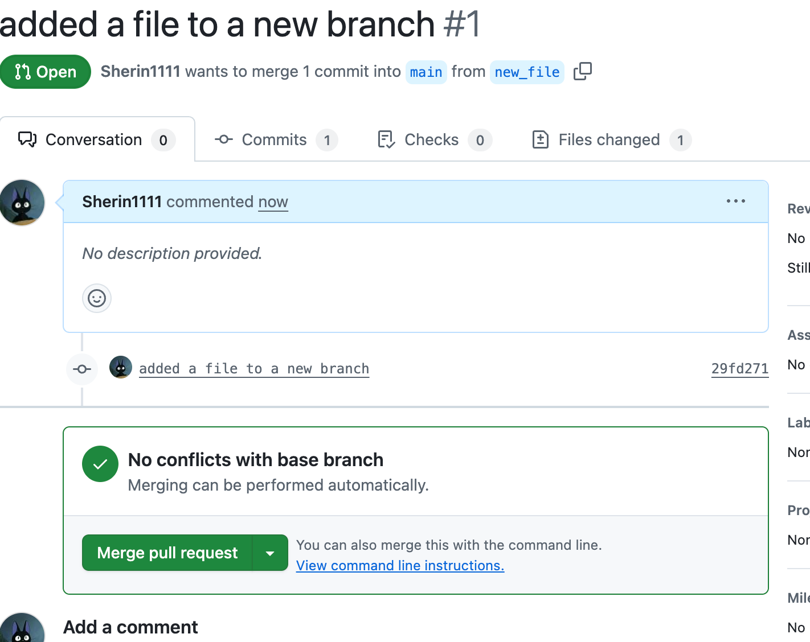

# CFG-Assignments

CFGDegree Foundation Module Assignments

<ins>About Me</ins>

**My name is Sherin Adam and I'm from London.**  
~I have done previous projects but not with CFGdegree.~  
I have done projects with SheCodes and recently completed SheCodes Plus.  
**_Projects:_**

- Interactive Landing Pages
- World Clock
- Weather App
- Peom Generator

### I created a new branch called new_file

## I opened a pull request

## I merged and deployed to main branch

## .gitignore is used for when you do not want certain files and folders tracked.

## requirements.txt is used to to list all the external packages and which verions you need to run the project.
