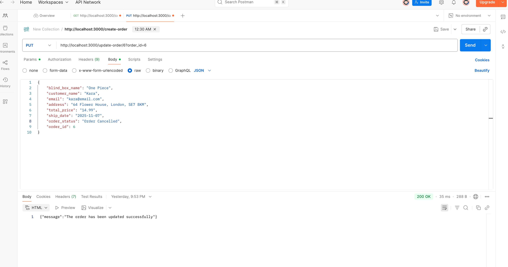
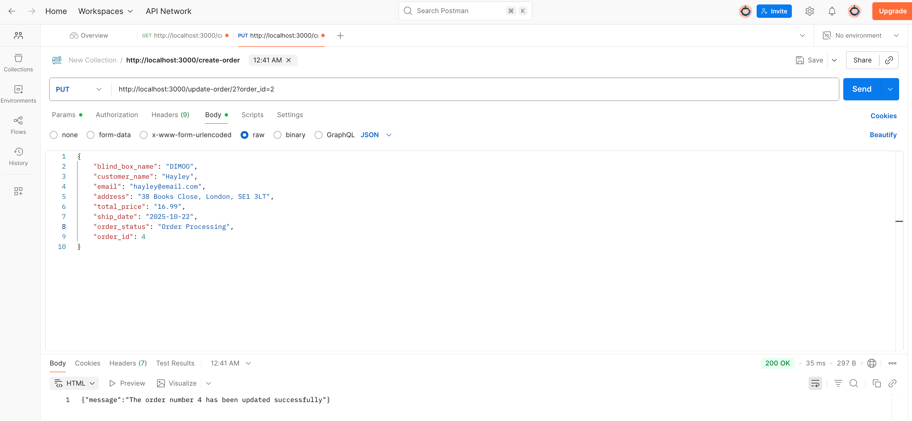

# Blind Box API

## Description

I created an API that manages customer orders for blind box figurines. The API tracks the full order lifecycle, from the initial sale to shipment by using the following statuses:
**Order Received, Order Processing, Order Shipped, Order Fulfilled, Order Cancelled, and Order Refunded.**

With more time, I would have added an additional table to manage stock levels and product availability (e.g., Available, Preorder, Out of Stock).

## Installation

1. Initialise a new **Node.js** project `npm init -y`
2. Install the framework **Express.js** `npm install express`
3. Install dependencies `npm install cors body-parser`
4. Install **MySQL2** `npm install mysql2`
5. install **dotenv** `npm install dotenv`
6. Start your server `npm start`

### Setup

In your **package.json** file, replace <br />
`"scripts": {"test": "echo \"Error: no test specified\" && exit 1"` <br />
with <br />
`"scripts": {"start": "node index.js"` <br />
then run <br />
`npm start`

Your server will be live at `http://localhost:3000`

## Connecting to The Database

Create a **.env** file and add your **MySQL** password <br />
**`password: "Your mySQL password`** <br />
Make sure **.env** is listed in your **.gitignore** file to protect your password. <br />
In your **index.js**, include `const dotenv = require('dotenv')`

## MySQL - Database and Table

Create your Database and table in **MySQL**

```CREATE DATABASE blindBoxWeb;
   USE blindBoxWeb;

   CREATE TABLE customer_order (
      order_id INT AUTO_INCREMENT PRIMARY KEY,
      blind_box_name VARCHAR(100) NOT NULL,
      customer_name VARCHAR(50) NOT NULL,
      email VARCHAR(100) NOT NULL,
      address VARCHAR(100) NOT NULL,
      total_price DECIMAL(5 , 2 ) NOT NULL,
      ship_date DATE NULL,
      order_status VARCHAR(50) NOT NULL
 );
```

## API Endpoint

You can test the endpoints using **Postman**:

| Method | Endpoint                | Description              |
| ------ | ----------------------- | ------------------------ |
| POST   | /create-order           | Submit a new order       |
| GET    | /order                  | Retrieve all orders      |
| PUT    | /update-order/:order_id | Update an existing order |
| DELETE | /delete-order/:order_id | Delete an order          |

### Testing POST


### MySql Table with Submitted Orders


### Testing GET


### Testing PUT

Order Cancelled


Order Fulfilled


Order Processing


### MySQL with Updated Order Statuses


### Testing DELETE


### MySQL Table after Deletion


